# Sistem Manajemen Tanaman Obat Keluarga (TOGA)

## Deskripsi
Program ini adalah aplikasi berbasis teks untuk mengelola data Tanaman Obat Keluarga (TOGA). Program dibuat menggunakan bahasa pemrograman Java dengan menerapkan konsep Object Oriented Programming (OOP) seperti class, object, property, method, dan constructor.

Program memiliki 3 class utama yaitu Tanaman, Pengguna, dan Catatan. Catatan berfungsi sebagai penghubung antara Pengguna dan Tanaman yang mencatat siapa yang menanam tanaman apa.

---

## Struktur Class
- **Tanaman** : menyimpan nama tanaman, nama latin, dan manfaat
- **Pengguna** : menyimpan nama dan alamat pengguna yang menanam TOGA
- **Catatan** : mencatat pengguna mana yang menanam tanaman apa beserta keterangannya

---

## Alur Program
1. Program menampilkan menu utama dengan 3 pilihan: Kelola Tanaman, Kelola Pengguna, dan Kelola Catatan
2. Setiap menu memiliki submenu CRUD masing-masing (Tambah, Lihat, Ubah, Hapus)
3. Untuk menambah Catatan, data Tanaman dan Pengguna harus sudah ada terlebih dahulu
4. Saat Tanaman dihapus, Catatan yang terkait dengan tanaman tersebut ikut terhapus
5. Saat Pengguna dihapus, Catatan yang terkait dengan pengguna tersebut ikut terhapus
6. Program terus berjalan sampai pengguna memilih menu keluar

---

## Tampilan Program

### Menu Utama
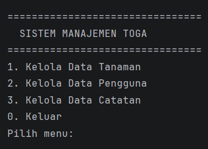

### Menu Tanaman

### Tambah Tanaman
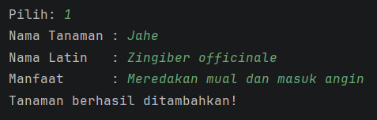

### Lihat Tanaman
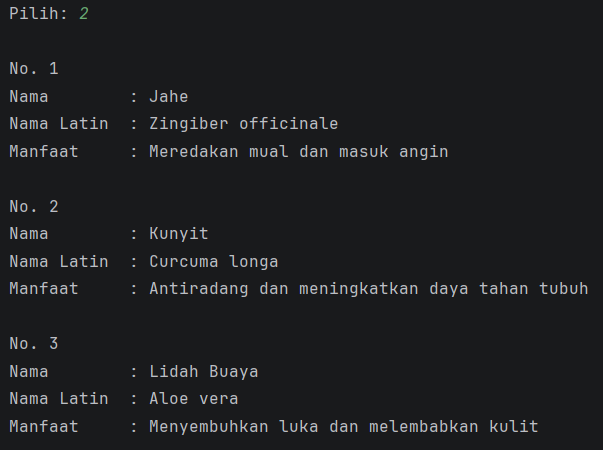

### Ubah Tanaman
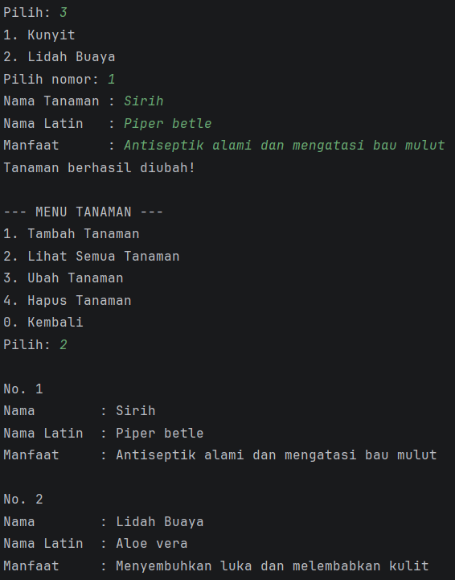

### Hapus Tanaman
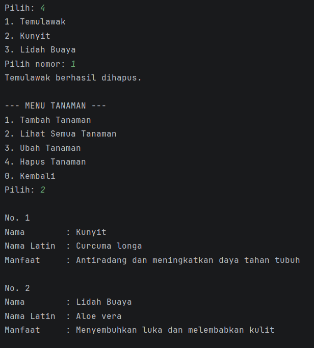

### Menu Pengguna
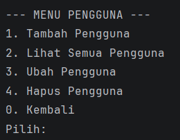

### Tambah Pengguna
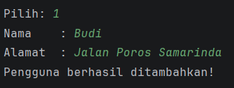

### Lihat Pengguna

### Ubah Pengguna
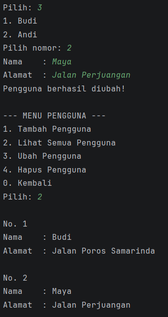

### Hapus Pengguna

### Menu Catatan

### Tambah Catatan
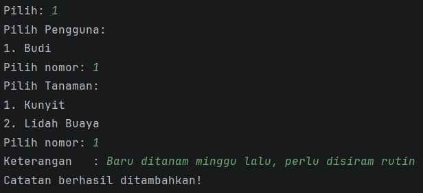

### Lihat Catatan

### Ubah Catatan

### Hapus Catatan
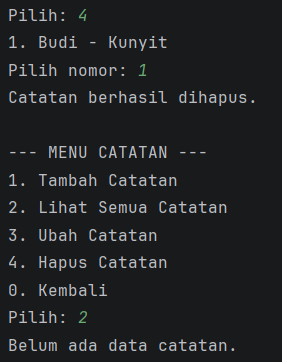

### Keluar Program
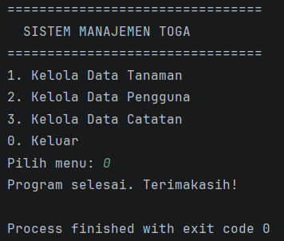