## Nama : Nabilah Alfa Rahmah
## NIM : 2409106004

---

# Sistem Manajemen Tanaman Obat Keluarga (TOGA)

## Deskripsi
Program ini adalah aplikasi berbasis teks untuk mengelola data Tanaman Obat Keluarga (TOGA). Program dibuat menggunakan bahasa pemrograman Java dengan menerapkan konsep Object Oriented Programming (OOP) seperti class, object, property, method, dan constructor.

Program memiliki 3 class utama yaitu Tanaman, Pengguna, dan Catatan. Catatan berfungsi sebagai penghubung antara Pengguna dan Tanaman yang mencatat siapa yang menanam tanaman apa.

Program ini adalah lanjutan dari posttest sebelumnya dengan menerapkan konsep Encapsulation, Access Modifier, dan Package menggunakan build tool Maven.

Program ini adalah lanjutan dari posttest sebelumnya dengan menambahkan konsep Inheritance.

---

## Struktur Class
- **Tanaman** : menyimpan nama tanaman, nama latin, dan manfaat
- **Pengguna** : menyimpan nama dan alamat pengguna yang menanam TOGA
- **Catatan** : mencatat pengguna mana yang menanam tanaman apa beserta keterangannya

---

## Alur Program
1. Program menampilkan menu utama dengan 3 pilihan: Kelola Tanaman, Kelola Pengguna, dan Kelola Catatan
2. Setiap menu memiliki submenu CRUD masing-masing (Tambah, Lihat, Ubah, Hapus)
3. Untuk menambah Catatan, data Tanaman dan Pengguna harus sudah ada terlebih dahulu
4. Saat Tanaman dihapus, Catatan yang terkait dengan tanaman tersebut ikut terhapus
5. Saat Pengguna dihapus, Catatan yang terkait dengan pengguna tersebut ikut terhapus
6. Program terus berjalan sampai pengguna memilih menu keluar

---

## Penerapan Access Modifier
1. Private
   Digunakan pada: Semua properti di semua class
   Fungsi: Menyembunyikan data sepenuhnya dari luar class. Properti tidak bisa diakses atau diubah langsung dari luar, termasuk dari Main.java. Akses hanya boleh melalui getter dan setter.

2. Public
   Digunakan pada: Semua getter, setter, constructor, dan method tampilInfo()
   Fungsi: Membolehkan akses dari mana saja, termasuk dari package berbeda. Getter dan setter yang bersifat public inilah satu-satunya cara untuk membaca atau mengubah properti yang private.

3. Protected
   Digunakan pada: Properti nama di class Tanaman
   Fungsi: Membolehkan akses dari subclass di package manapun. Jika nanti ada class yang mewarisi Tanaman (misalnya TanamanLangka extends Tanaman), properti nama bisa langsung diakses tanpa getter.
   (update: sudah terpakai di pt 4)

4. Default (tanpa modifier)
   Digunakan pada: Method getInfoSingkat() di class Tanaman dan Pengguna
   Fungsi: Membatasi akses hanya dalam satu package yang sama (com.toga.model). Method ini hanya bisa dipanggil oleh class lain yang berada di package com.toga.model — dalam hal ini dipanggil oleh Catatan lewat method buatRingkasan(). Jika Main.java mencoba memanggil getInfoSingkat() langsung, maka akan error karena Main berada di package berbeda (com.toga).

---

## Library dari Luar (Apache Commons Lang)
Project ini menggunakan Apache Commons Lang versi 3.12.0 sebagai library dari luar yang dikelola oleh Maven.
Digunakan untuk: Validasi input di semua setter menggunakan StringUtils.isBlank() dari package org.apache.commons.lang3. 
Method ini mengecek apakah string kosong, null, atau hanya berisi spasi, lebih lengkap dibanding cek manual == null || isEmpty().

---

## Getter & Setter
Setiap properti private dilengkapi getter dan setter public. Setter dilengkapi validasi menggunakan StringUtils.isBlank() dari Apache Commons Lang, 
data tidak bisa diubah jika input kosong atau hanya spasi.

---

## Inheritance yang diterapkan
Tipe Inheritance: Hierarchial Inheritance yaitu Satu superclass (Tanaman) diwarisi oleh lebih dari satu subclass.
```
Tanaman (superclass)
├── TanamanRempah (subclass)
├── TanamanDaun   (subclass)
└── TanamanBuah   (subclass)
```

### Relasi is-a
- TanamanRempah **is a** Tanaman
- TanamanDaun **is a** Tanaman
- TanamanBuah **is a** Tanaman

### Superclass: Tanaman
Menyimpan data umum yang dimiliki semua jenis tanaman: nama, namaLatin, manfaat.

### Subclass dan properti tambahannya
| Subclass | Properti Tambahan | Contoh Tanaman |
|---|---|---|
| `TanamanRempah` | `aroma` | Jahe, Kunyit, Kencur |
| `TanamanDaun` | `bentukDaun` | Sirih, Mint, Sambiloto |
| `TanamanBuah` | `musimBerbuah` | Mengkudu, Jeruk Nipis |


### Keyword yang digunakan
- `extends` — untuk membuat subclass dari superclass
- `super()` — dipanggil di constructor subclass untuk memanggil constructor superclass
- `super.tampilInfo()` — dipanggil di subclass untuk menampilkan data dari superclass sebelum data tambahan
- `@Override` — menandai bahwa method `tampilInfo()` di subclass menimpa milik superclass

---

## Struktur Package
```
src/
└── main/
    └── java/
        └── com/
            └── toga/
                ├── Main.java
                └── model/
                    ├── Tanaman.java
                    ├── TanamanRempah.java
                    ├── TanamanDaun.java
                    ├── TanamanBuah.java
                    ├── Pengguna.java
                    └── Catatan.java
```

---
## Tampilan Output Program

### Menu Utama


### Menu Tanaman
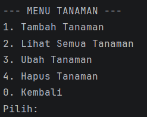

### Pilih Jenis Tanaman
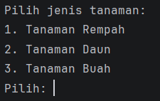

### Tambah Tanaman Rempah
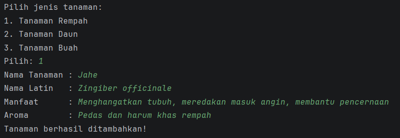

### Tambah Tanaman Daun
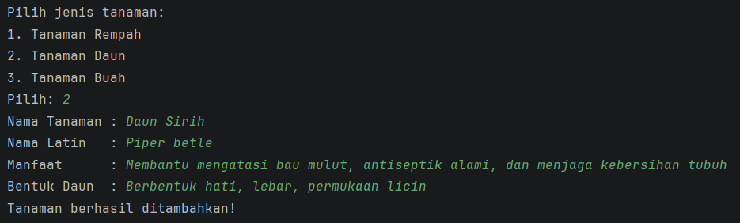

### Tambah Tanaman Buah
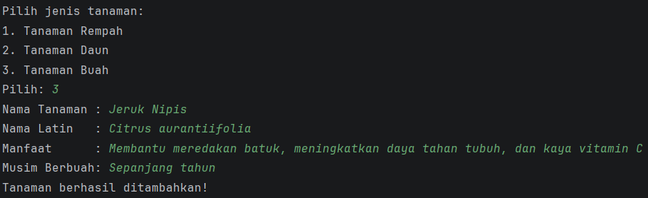

### Lihat Tanaman
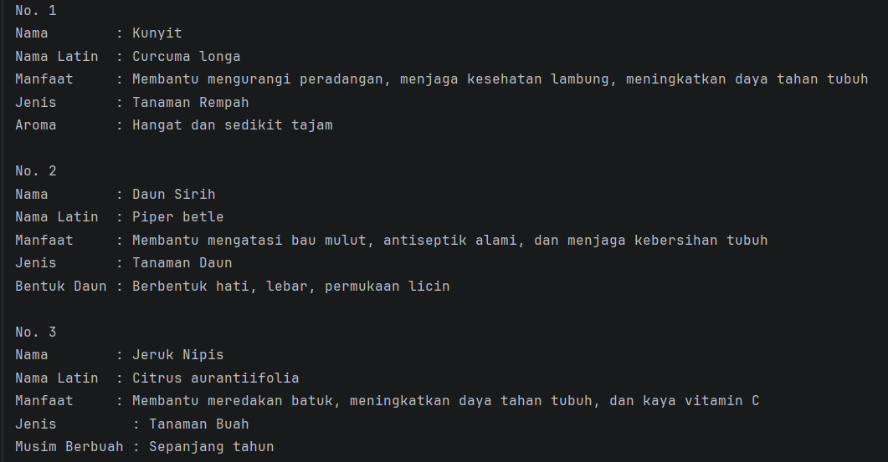

### Ubah Tanaman
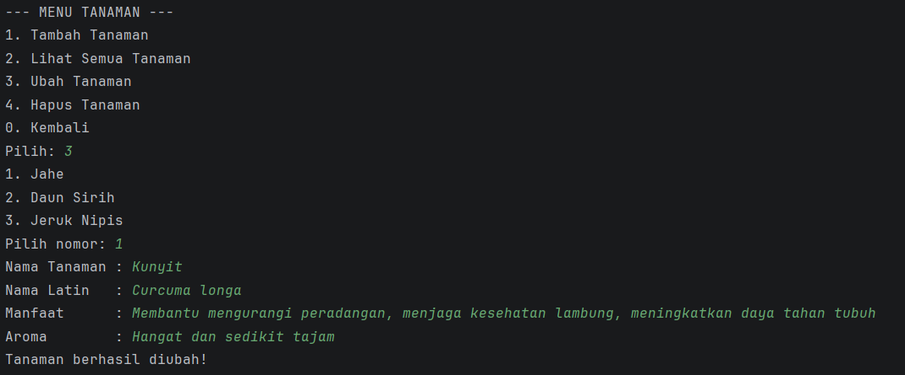

### Hapus Tanaman
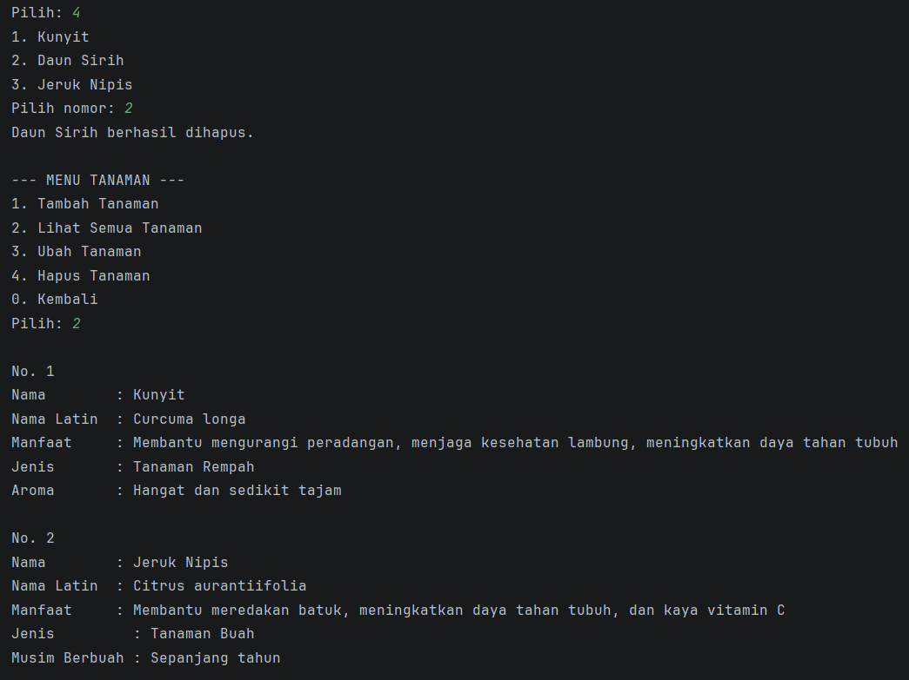

### Menu Pengguna


### Tambah Pengguna


### Lihat Pengguna
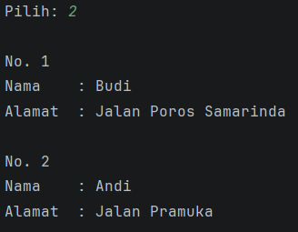

### Ubah Pengguna


### Hapus Pengguna
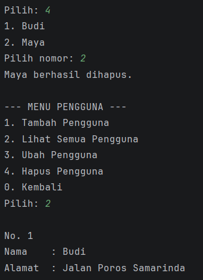

### Menu Catatan
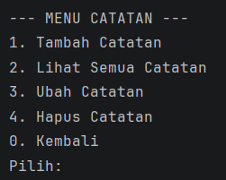

### Tambah Catatan
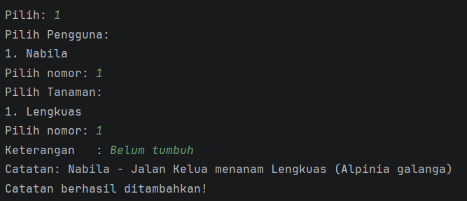

### Lihat Catatan
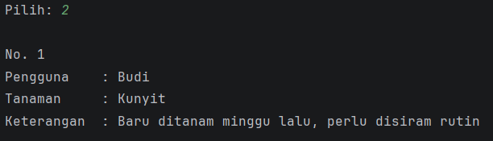

### Ubah Catatan
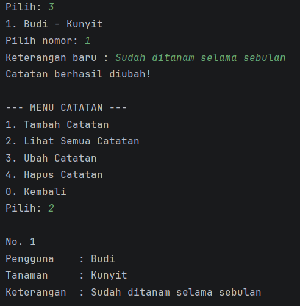

### Hapus Catatan


### Keluar Program
